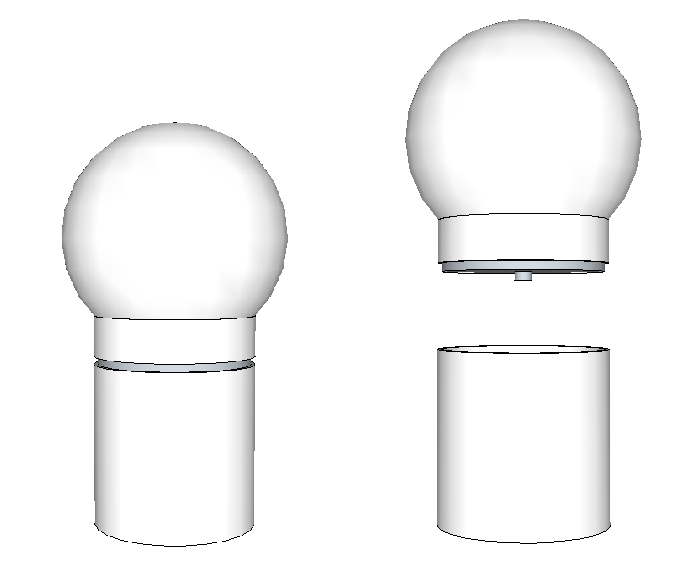

# Tamis

## Fonctionnement

Le spectateur dispose d'un cerceau sur lequel est tendue une toile blanche. Avec celui-ci, il recouvre la sphère et déforme le tissu en descendant le cerceau : une nuée de particules se génère selon la pression appliquée et apparait projetée sur le tissu. En inclinant le cerceau, les particules glissent et subissent la gravité du cerceau.

*Extrait de https://www.flickr.com/photos/erasme/16971840969/in/album-72157649005948273/*

*Extrait de https://www.flickr.com/photos/erasme/17836948143/in/album-72157651686214333/*

## Matériel électronique et informatique

* Une carte `Arduino Uno`
* Un `pressure sensor`
* Un `accéléromètre`
* Un ordinateur
* Un vidéo-projecteur

## Principe

L'objet est composé de deux éléments s'imbriquant. L'élément du haut est composé d'une sphère et d'une colonne, l'élément du bas prolonge cette colonne et sert de socle.

Sur l'élément du haut se trouve un élément circulaire permettant d'appuyer sur le `pressure sensor` de l'élément du bas lorsque les deux éléments sont imbriqués.

![Mécanisme][Images/Mecanisme.png)

